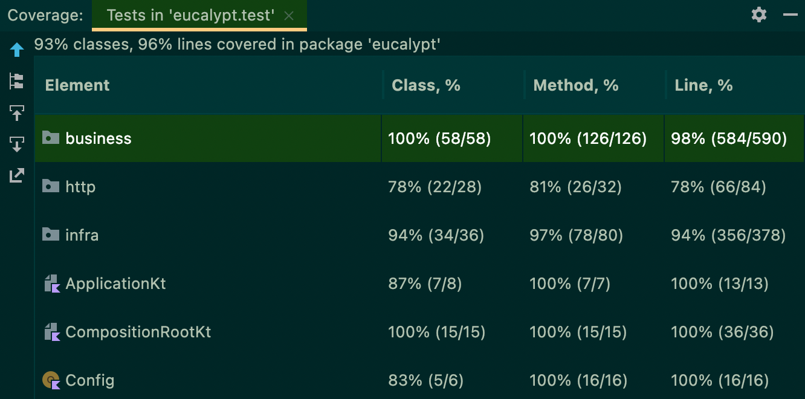
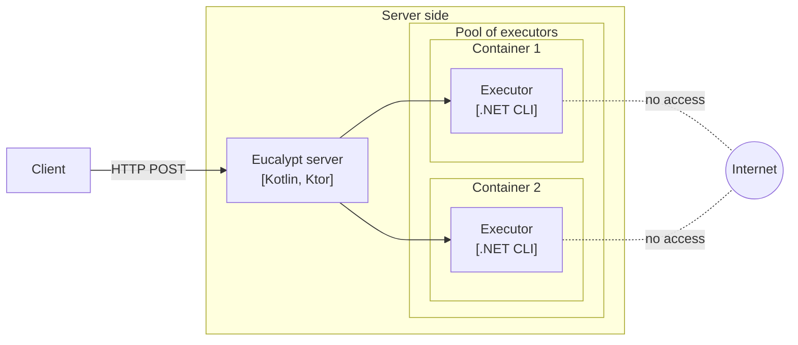
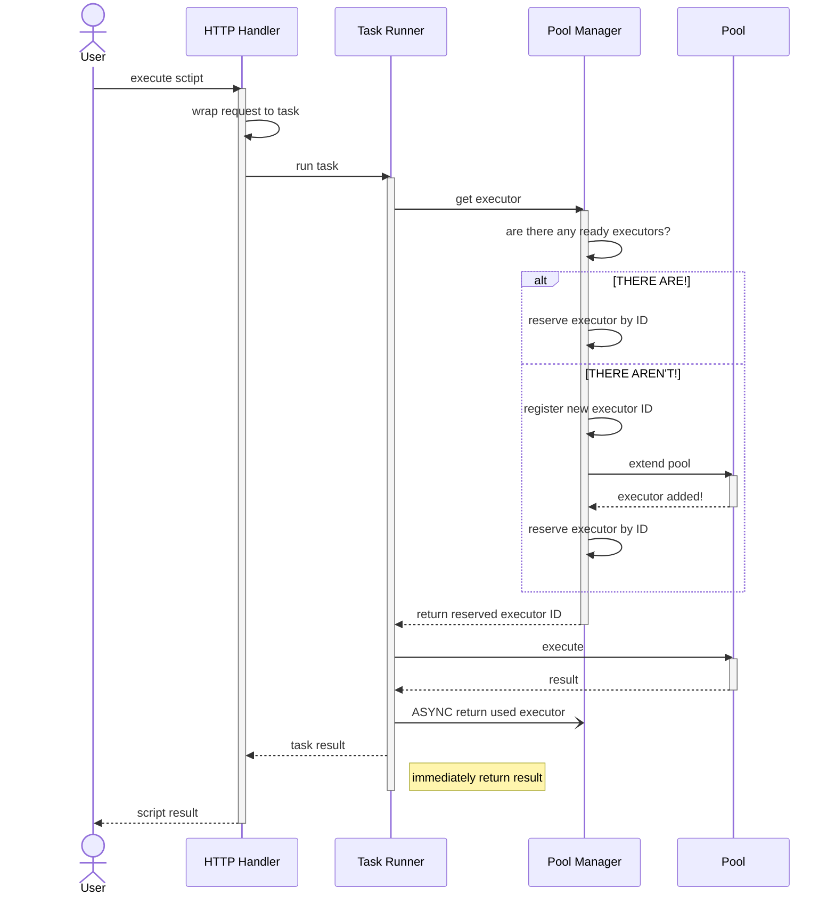
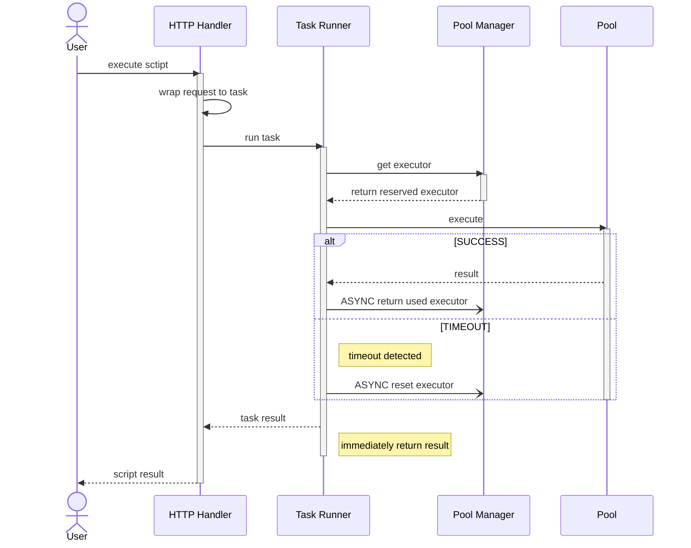
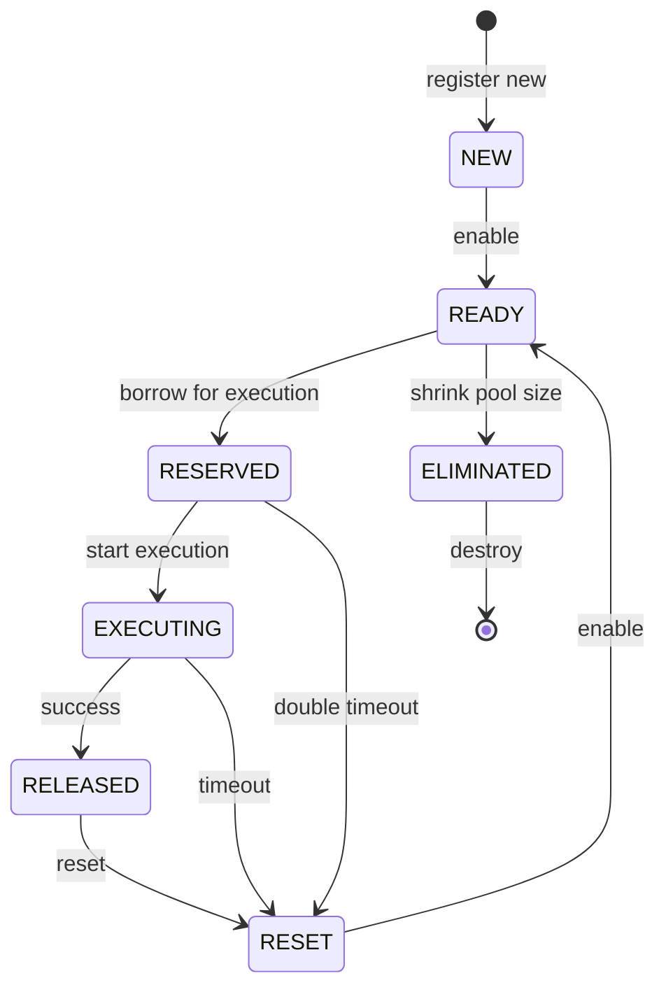
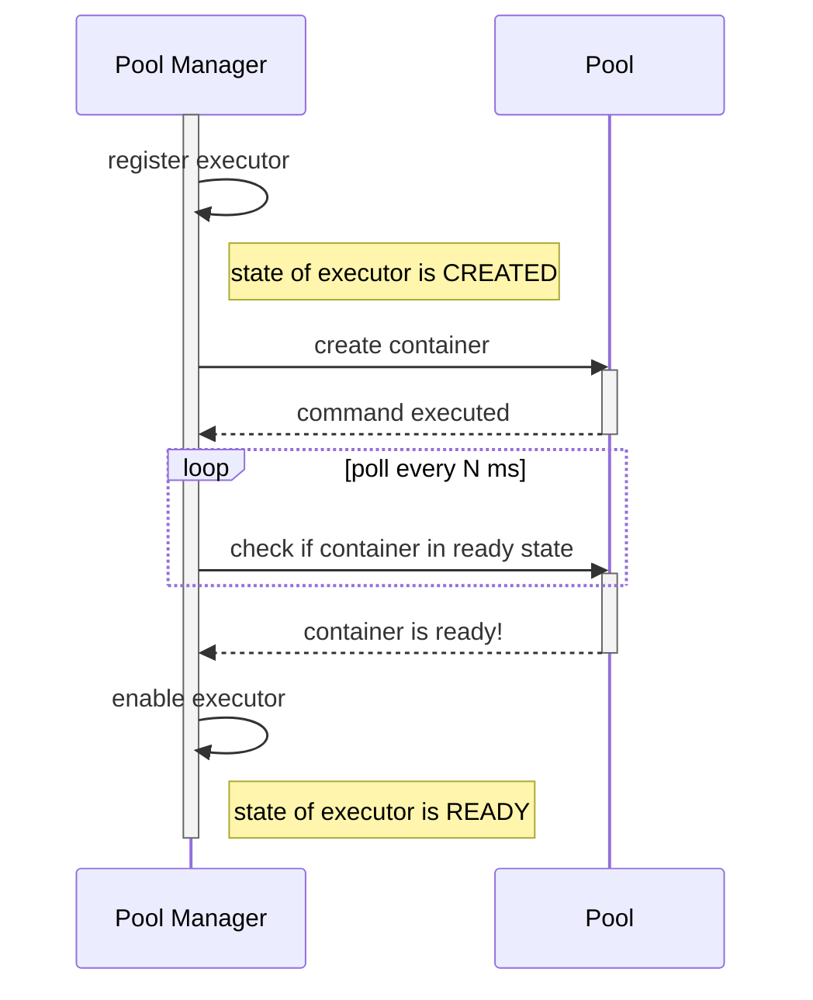
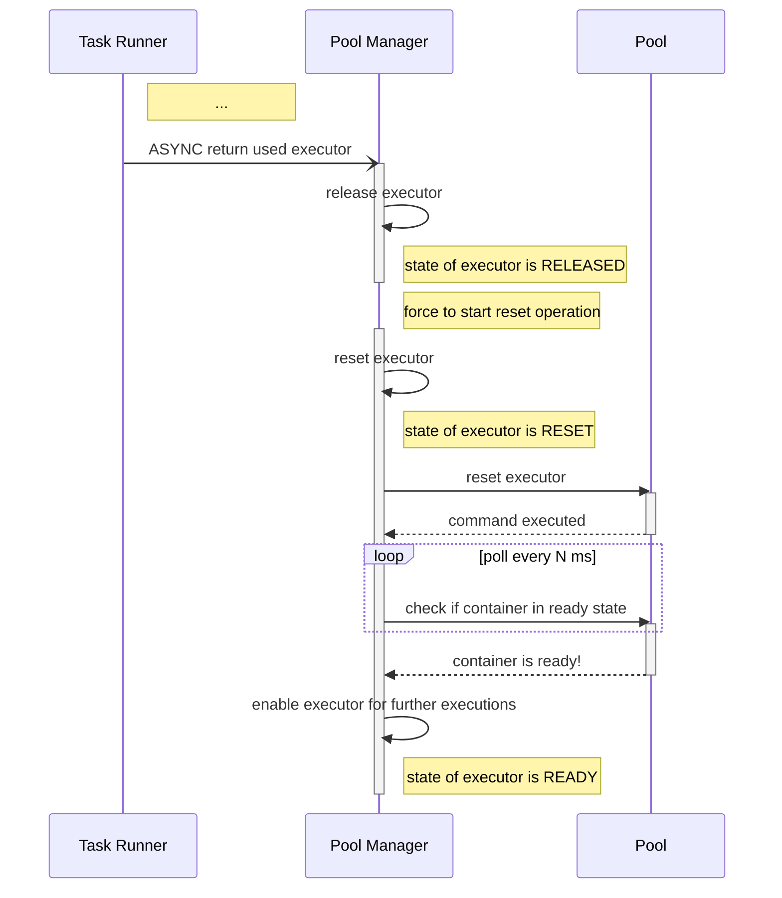

# Eucalypt
Script execution by HTTP. Currently only .NET/C# is supported

## About
* [Ktor](https://ktor.io) for HTTP server
* [Koin](https://insert-koin.io) for dependency injection
* Script runners – a.k.a. executors – are [Docker](https://www.docker.com) containers with memory, CPU restrictions and network isolation. Also [TMPFS](https://en.wikipedia.org/wiki/Tmpfs) used instead of real filesystem
* Containers ran from pre-build images located `./src/src/images`
* Executres united in pool. It's is able to automaticaly extend and shink it's own size, detects hanged executors and re-run them

## How to run
### Before
You need
* Docker
* Gradle
* GNU Make
* curl
* IntelliJ IDEA

It has been written and tested on MacBook Pro (14-inch, 2021) Apple M1 Pro, RAM 32 GB via IntelliJ IDEA 2021.3.3 (Ultimate Edition).

⚠️ Before first run you must build executos images
```
make build.images
```

### Run
Since project was generated by Ktor template I always ran IntelliJ IDEA.<br/>
### Run tests
To run tests you can also use
```
cd ./src
gradle test
```
or again just run from IntelliJ IDEA.

#### Coverage
There are 69 unit tests on logic and 1 integrational test for main happy path. Used JUnit 5 + [mockk](https://mockk.io)


### Try
Check some examples in `./examples` directory. You can easly CURL it via makefile. <br/>
To print available tasks
```
make
```

To build executors' images
```
make build.images
```

To run example first of all run server and then make
```
make dotnet.hw      # hello world!
make dotnet.fib     # Fibonacci numbers up to 42
make dotnet.fio     # writes some lines to file and reads it
make dotnet.inf     # infinity operation: aborted by timeout and prints stdout
make dotnet.inv     # invalid code that doesn't compile
```

For example:
```
❯ make dotnet.hw
> Executing on .NET SDK 6.0
> Resources: CPU 1.5, RAM 100 MB, space 100 MB, network - false

> Output:

Hello World!

------------------------------
✓ Script executed successfully
> Time elapsed: 2 seconds
```
```
❯ make dotnet.inv
> Executing on .NET SDK 6.0
> Resources: CPU 1.5, RAM 100 MB, space 100 MB, network - false

> Output:

Microsoft (R) Build Engine version 17.1.0+ae57d105c for .NET
Copyright (C) Microsoft Corporation. All rights reserved.

/exec-dir/Program.cs(9,29): error CS1002: ; expected [/exec-dir/Main.csproj]

Build FAILED.

/exec-dir/Program.cs(9,29): error CS1002: ; expected [/exec-dir/Main.csproj]
    0 Warning(s)
    1 Error(s)

Time Elapsed 00:00:00.85

------------------------------
✓ Script executed successfully
> Time elapsed: 1 seconds
```
```
❯ make dotnet.inf
> Executing on .NET SDK 6.0
> Resources: CPU 1.5, RAM 100 MB, space 100 MB, network - false

> Output:

Running...
Running...
Running...

----------------------------------------------------
✗ Script running timeout exceeded. Execution aborted
> Time elapsed: 10 seconds
```


## Architecture
### Data flow


### Contol

``` mermaid
graph TB
    subgraph Eucalypt app
        HTTPServer["HTTPServer <br/><br/> Serve HTTP requests"]:::Code
        ScriptRunner["Script runner <br/><br/> - run script on <br/> borrowed executor"]:::Code
        ExecutorsManager["ExecutorsManager <br/> <br/> - borrows executor <br/> - returns (redeem) executor"]:::Code
        ExecutorsPool["ExecutorsPool <br/><br/> - returns available executors <br/> - auto extend/shrink <br/> - monitor state and eliminate hanged <br/> - reserve executor for run safely "]:::Code
        Executor["Executor <br/><br/>- executes scripts <br/> - manages underlying container <br/> - can be reserved for safe execution"]:::Code
        DockerEventsMonitor["DockerEventsMonitor <br/><br/> - monitors containers events <br/> - invoke registered callbacks <br/> for every event"]:::Code
        DockerContainer["DockerContainer <br/><br/> - provides basic control <br/> - reflect current containers state"]:::Code
        DockerOperator["DockerOperator <br/><br/> - run container <br/> - re-run container <br/> - remove container <br/> - monitor Docker events"]:::Code
        

        HTTPServer --> ScriptRunner -- borrow executor --> ExecutorsManager
        ExecutorsManager -- get available --> ExecutorsPool
        ScriptRunner -- execute --> Executor
        ExecutorsPool -- manage --> Executor
        ExecutorsManager -- reserve --> Executor
        Executor -- contol --> DockerContainer
        DockerContainer -. sync state .-> Executor
        DockerContainer -- subscribe --> DockerEventsMonitor
        DockerEventsMonitor -. invoke callback to udapte state .-> DockerContainer
        DockerEventsMonitor -- listen events --> DockerOperator
        DockerContainer -- contol --> DockerOperator
    end

    classDef Code fill: white, stroke: black
    classDef Pool fill: white, stroke: black, stroke-dasharray: 5 5
```


## Scenarious
### Happy path


### Timeout of execution


### Pool management processes
Executors have several states:
* NEW – just created; should be checked for readiness
* READY – ready for execution
* RESERVED – locked for specific task; state can be changed only by original task or can be killed by double timeout
* EXECUTING – in the middle of execution; can be killed by timeout
* RELEASED – unlocked by task; should be reset
* RESET – in the middle of reset
* ELIMINATED – marked for elimination; should be destoryed



#### Executor creating


#### Release and reset executor


## What's next?
* Configuration files instead of hard-coded `Config` object to configure withour rebuild
* WebSockets to consume running script output line-by-line. That makes execution more interactive for end user
* Containerize server. This require some changes: operating containers from another container has some difficulties and requires paradigm changing. But in this case I'd prefer to delegate pool management to orchestration tool like [Kubernates](https://kubernetes.io)
* Run pool on several hosts. Again, it will be reasonable to consider using container orchestrator for that
* To achieve a posibility to use NuGet it's necessesary: 1) to provide list of packages; 2) make new type of executor with availability to use network by specific URL; 3) Docker network configuration management
* Support other languanges. Just add executors and wire it up with HTTP interface
